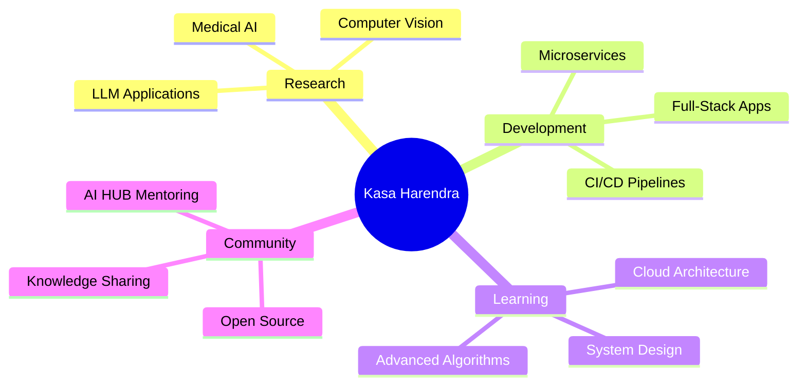

# 👋 Hi, I'm Kasa Harendra

<div align="center">
  
</div>


<hr>

<div align="center">
  
[](https://www.linkedin.com/in/harendra-kasa-13a238329/)
[](mailto:harendrakasa@gmail.com)
[](#)

</div>

---

## 🚀 About Me

I'm a passionate **Full-Stack AI Developer** and 3rd-year B.Tech AI/ML student who transforms ideas into production-ready solutions. Currently building intelligent and AI application systems that serve 100+ users.

```python
class Harendra:
    def __init__(self):
        self.role = "Full-Stack AI Developer"
        self.location = "Guntur, Andhra Pradesh, India"
        self.education = "B.Tech AI/ML (CGPA: 9.38/10)"
        self.current_focus = ["Production AI Systems", "Full-Stack Development", "Research"]
        self.experience = {
            "intern": "CDAC-Intern",
            "projects": "3+ Production-Ready Applications",
        }
    
    def current_work(self):
        return [
            "🔬 Researching GenAI and LLMs",
            "🚀 Building scalable AI-powered web applications",
            "📚 Student Admin at AI HUB"
        ]
```

---

## 🛠️ Tech Arsenal

<div align="center">

### 💻 Programming Languages


<!--  -->


### 🤖 AI/ML & Data Science


<!--  -->


### 🌐 Web Development
<!--  -->


<!--  -->


### ☁️ Cloud & DevOps
<!--  -->


### Deployments


### 💻 IDEs/Editors


### 🗄️ Databases


</div>

---

## 🏆 Achievements & Certifications

<div align="center">

<table>
<tr>
<td align="center" width="50%">

### 🏆 Achievements
**🖇️ Novel Graph Coloring Algorithm**  
*Published O(n+m) algorithm outperforming traditional methods*  

**🌐 German Language Workshops**  
*Represented KV Guntur at Hyderabad & Mysore (Goethe Institute)*  
*🥇 Stood 1st in Fit-1 Examination*  

**📚 Hackathons & Projects**  
*Developed multiple AI-powered tools, streamlining workflows by 70%+*  

</td>
<td align="center" width="50%">

### 💼 Experience
**💻 Intern – High Performance Computing (HPC)**  
*CDAC Pune | Apr 2025 – Jun 2025*  
- 📊 Graph representation & visualization of telecom traffic data  
- ⚡ Hands-on with **NetworkX, GPU Architecture, CUDA/OpenACC**  
- 🧠 Strong problem-solving in **HPC & Data Visualization**   

</td>
</tr>
</table>

</div>

---

## 🔥 Featured Projects

<div>

### ⚡ GPU-Accelerated Image Classification  
*High-performance deep learning with PyTorch & CUDA*  

[](link)  
[](link)  

**Performance Highlights:**  
- 🚀 Trained CNN on **CIFAR-10** with GPU acceleration  
- 🔍 Benchmarked **CPU vs GPU memory & execution** pipelines  
- 🧮 Applied **thread divergence, shared memory, warp execution** concepts  
- 📈 Improved training speed and efficiency using GPU-backed pipelines  

---

### 📄 README Generator  
*AI-powered documentation tool for GitHub developers*  

[](link)  
[](link)  
[](link)  
[](link)  

**Key Features:**  
- 🔐 **GitHub OAuth** for secure authentication & repo access  
- ✍️ **AI-powered README generation** with Gemini API  
- ⚡ **Dynamic UI** using EJS for real-time editing & preview  
- 📊 Boosted documentation productivity by **70%+**  

🔗 [Live Demo](https://readme-generator-ai-app.vercel.app/)  

---

### 📊 Data Tool — Streamlit Utility  
*Seamless data handling & visualization app*  

[](link)  
[](link)  
[](link)  

**Utility Features:**  
- 📂 **Dataset upload, edit & transform** in one interface  
- 📈 **Dynamic plots** powered by Plotly for real-time insights  
- ⚙️ Modular **data preprocessing & cleaning** workflows  
- ⏱️ Reduced **manual workload** in data visualization tasks  

🔗 [Live Demo](https://data-tool-harendra.streamlit.app/)  

---

### 🖇️ Novel Graph Coloring Algorithm  
*Optimized algorithm for real-time graph coloring*  

[](link)  
[](link)  

**Algorithm Strengths:**  
- ⏳ **Linear time complexity O(n+m)**  
- ⚡ Validated across **sparse, dense, cyclic & acyclic graphs**  
- 🧠 **Greedy heuristics + adjacency list** optimization  
- 📉 Reduced color conflicts & improved scalability  

🔗 [GitHub](https://github.com/Kasa-Harendra/DSA/blob/main/new_graph_coloring_algo.ipynb)  

---

### 🛒 Flipkart Web Scraper  
*Efficient e-commerce data extraction tool*  

[](link)  
[](link)  
[](link)  

**Scraping Features:**  
- 🔍 Extracted product details from Flipkart with **Scrapy spiders**  
- 📑 **Handled pagination & domain-limiting** for efficient crawling  
- 💾 **CSV export + UI integration** for plotting graphs  
- 📈 Structured data for **analysis-ready datasets**  

🔗 [GitHub](https://github.com/Kasa-Harendra/Web-Scraping-Project)  

---

### 🤖 AI-Data-Tool  
*AI-powered conversational data analysis platform*  

[](https://www.python.org/)  
[](https://streamlit.io/)  
[](https://www.langchain.com/)  

**Core Features:**  
- 📂 **Interactive Uploads**: Supports CSV & Excel files directly via Streamlit  
- 💬 **Conversational Queries**: Ask questions in plain English and get instant insights  
- 🧠 **Custom PandasAgent**: AI agent built on LangChain for intelligent data handling  
- 📝 **Transparent Execution**: Displays executed Pandas code for trust & learning  
- ⚡ **Real-time Visualizations**: Generate plots & summaries instantly  
- 🔄 **Session Management**: Clear chat history & reset analysis with one click  

🔗 [Live App](https://ai-data-tool.streamlit.app/)  

</div>

---

## 📊 GitHub Analytics

<div align="center">


</div>

<div align="center">

</div>

### 📈 Contribution Activity
<div align="center">

</div>

---

<!-- ## 🎯 Current Focus Areas

<div align="center">



</div> -->
 
**💻 Development**: Building scalable, production-ready applications  
**📚 Learning**: LLM optimization, Generative AI  
**👥 Community**: Student Admin of AI HUB initiatives

---

## 🌟 Professional Journey

<div align="center">

| Timeline | Role | Organization | Achievement |
|----------|------|--------------|-------------|
| **2025 - Present** | AI Mentor | AI HUB | 50+ students mentored |
| **2022 - 2026** | B.Tech Student | VVIT | CGPA: 9.38/10 |

</div>

---

## 🎨 Fun Facts & Interests

<div align="center">

<!-- 🎯 **Problem Solving**: 100+ LeetCode problems conquered   -->
🌍 **Languages**: English (Fluent), Telugu (Native), Hindi (Conversational), German (Intermediate)  
🎮 **Philosophy**: *"Code should be written for humans to read"*  
🚀 **Goal**: Building AI application systems that make a real-world impact  

</div>

---

## 📞 Let's Connect!

<div align="center">

I'm always excited to discuss:
- 🤖 AI/ML system architecture and optimization
- 🌐 Full-stack development and scalable systems
- 🔬 Research collaboration in computer vision

**📧 Email**: harendrakasa@gmail.com  
**⚡ Response Time**: Usually within 24 hours  
**🌍 Location**: Guntur, Andhra Pradesh, India  
**💼 Status**: Open to opportunities and collaborations

---

<div align="center">

</div>

<div align="center">
<i>⭐ "Building the future, one well-tested commit at a time." ⭐</i>
</div>

</div>
